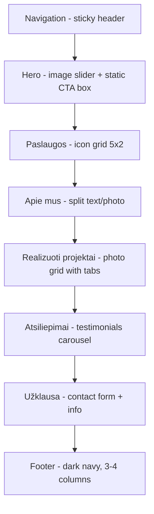

# PROJECT.md — NAMŲ OAZĖ

---

## Executive Summary

Namų Oazė (V. Rutkausko IVV) is a Kaunas-based construction and interior finishing company led by Vytautas Rutkauskas. The one-page website targets homeowners, apartment buyers, and commercial property owners seeking comprehensive construction, renovation, and finishing services across Lithuania. The site features a dark sticky header (Trinketa-style), a hero slider with a static CTA overlay (Taupalda-style), an icon-based services grid (Vakomanda-style), a completed projects photo gallery (Vakomanda-style), client testimonials carousel (Taupalda-style), a two-column inquiry form (Trinketa-style), and a compact dark footer (Trinketa-style). Typography uses Playfair Display for headings and Lora for body text. The color palette combines soft muted tones (#ACBAC4, #E1D9BC, #F0F0DB) with a deep navy (#30364F) on a white background, and all content is in Lithuanian. Logo sourced from info.lt business listing.

---

## Attribute Table

| Attribute | Source | Location |
|-----------|--------|----------|
| Business name | info.lt | Page heading |
| Tagline | User instructions | User message |
| Address | info.lt | "Partizanų g. 21, 49472 Kaunas" |
| Phone | info.lt | "(0 600) 30007" |
| Email | info.lt | Hidden on page — marked [PLACEHOLDER] |
| Manager | info.lt | "Vytautas Rutkauskas" |
| Logo | info.lt | https://www.info.lt/images/logotipai/2353875.jpg |
| Services list | info.lt | "Veiklos aprašymas" section |
| Service details | info.lt | "Prekės, paslaugos" + full description |
| Colors | User instructions | User message — hex + rgb values |
| Fonts | User instructions | Playfair Display + Lora (Google Fonts) |
| Hero reference | User instructions | taupalda.lt — changing images + static box |
| Services reference | User instructions + screenshots | vakomanda.lt — icon grid (screenshot 1) |
| Projects reference | User instructions + screenshots | vakomanda.lt — photo grid (screenshot 2) |
| Testimonials reference | User instructions + screenshots | taupalda.lt — carousel (screenshot 3) |
| Header reference | User instructions + screenshots | trinketa.lt — dark nav (screenshot 4) |
| Form + Footer reference | User instructions + screenshots | trinketa.lt — form & footer (screenshot 5) |
| Content language | User instructions | Lithuanian ("lt") |

---

## Client Information

```yaml
business_name: "NAMŲ OAZĖ"
legal_name: "V. Rutkausko IVV"
tagline: "Visi statybos ir apdailos darbai vienoje komandoje"
address: "Partizanų g. 21, 49472 Kaunas"
phone: "+370 600 30007"
phone_display: "(0 600) 30007"
email: "[PLACEHOLDER — confirm email address]"
owner: "Vytautas Rutkauskas"
social_links:
  facebook: "[PLACEHOLDER — confirm Facebook URL]"
  instagram: "[PLACEHOLDER — confirm Instagram URL]"
  other: ""
website: "https://www.info.lt/imones/V-Rutkausko-IVV/2353875"
content_language: "lt"
```

---

## Content Sources

```yaml
sources:
  - url: "https://www.info.lt/imones/V-Rutkausko-IVV/2353875"
    type: "directory"
    extract: "business name, address, phone, services, activity description, photos"
  - url: "https://taupalda.lt/"
    type: "website"
    extract: "hero slider layout with static CTA box, testimonials carousel layout"
  - url: "https://vakomanda.lt/"
    type: "website"
    extract: "services icon grid layout, realized projects photo grid layout"
  - url: "https://trinketa.lt/"
    type: "website"
    extract: "header/nav layout, footer layout, inquiry/contact form layout"
```

---

## Provided Content

```
# About text (extracted from info.lt):

Mes atliekame šias paslaugas: karkasinių namų statyba, stogų dengimas, butų
įrengimas, butų ir kitų patalpų remontas, apdailos darbai, "kosmetinis"
remontas, renovacija, komercinių patalpų įrengimas, namų remontas, dalinė
arba pilna apdaila, įrengimas, tvorų įrengimas, elektros instaliacija,
terasų įrengimas, gipskartonio montavimas, plytelių klojimas, glaistymas,
dažymas, įvairūs bendrastatybiniai darbai ir kt. statybos darbai.
Atliekame darbus visų tipų objektuose. Vykdome tiek stambius, tiek
smulkius užsakymus, susijusius su bet kokio tipo apdaila, renovacija ir kt.
Visi darbai atliekami profesionaliai ir kokybiškai. Atliktiems darbams
suteikiame garantiją.

# Service categories (extracted from info.lt):

- Vidaus apdailos darbai
- Kanalizacijos, drenažo įrengimas
- Terasų, tvorų įrengimas
- Gipskartonio montavimas, glaistymas, dažymas
- Plytelių klojimas
- Trinkelių klojimas
- Statybos darbai
- Stogų dengimas
- Elektros instaliacija
- Karkasinių namų statyba
- Butų įrengimas ir remontas
- Komercinių patalpų įrengimas
- Renovacija

# Any other copy:

(none provided — use about text and service list above)
```

---

## Brand Assets

```yaml
logo_file: "https://www.info.lt/images/logotipai/2353875.jpg"
logo_note: "Download from info.lt and save to assets/logo.jpg — use in nav and footer"
wordmark_text: "NAMŲ OAZĖ"
wordmark_style: "Playfair Display, spaced uppercase, medium weight, letter-spacing 0.10em"
```

---

## Color Tokens

```css
:root {
  --bg-base:      #FFFFFF;           /* main page background — white */
  --bg-elevated:  #F0F0DB;           /* alternating sections — warm ivory */
  --bg-warm:      #E1D9BC;           /* warm accent sections */
  --bg-muted:     #ACBAC4;           /* muted blue-grey accent */
  --bg-dark:      #30364F;           /* footer, dark sections — deep navy */
  --text-primary: #30364F;           /* main body text — deep navy */
  --text-muted:   #6B7280;           /* captions, secondary text */
  --accent:       #ACBAC4;           /* borders, highlights, icons */
  --accent-warm:  #E1D9BC;           /* warm accent for hover states, CTA borders */
  --text-on-dark: #F0F0DB;           /* text on dark backgrounds — warm ivory */
  --text-white:   #FFFFFF;           /* white text on overlays */
}
```

**Color mapping rationale:**

| Hex | RGB | Usage |
|-----|-----|-------|
| `#30364F` | rgb(48, 54, 79) | Primary text, dark backgrounds, navy headings |
| `#ACBAC4` | rgb(172, 186, 196) | Borders, icon accents, muted highlights |
| `#E1D9BC` | rgb(225, 217, 188) | Warm section backgrounds, CTA buttons, hover states |
| `#F0F0DB` | rgb(240, 240, 219) | Elevated section backgrounds, text on dark |
| `#FFFFFF` | rgb(255, 255, 255) | Main page background — white |

---

## Typography

```yaml
display_font: "Playfair Display"
display_weights: [400, 700]
display_style: "normal for section headings, italic optional for hero"

body_font: "Lora"
body_weights: [400, 500, 600, 700]

hero_headline:
  font_style: "normal"
  font_size: "clamp(2.5rem, 6vw, 4.5rem)"
  letter_spacing: "-0.02em"
  accent_words: "italic or colored with var(--accent-warm) — see Trinketa hero reference"

section_headings:
  font_style: "normal"
  font_size: "clamp(1.8rem, 4vw, 3rem)"
  text_transform: "none"

labels_nav:
  font_family: "Lora"
  text_transform: "none"
  letter_spacing: "0.04em"
  font_size: "0.9rem"
  font_weight: "500"
```

---

## Photo Treatment

```yaml
global_filter: "contrast(1.02) saturate(0.92)"
hover_filter: "saturate(1.05) brightness(1.02)"
hover_duration: "300ms"
```

---

## Page Sections — Build in This Order

### 1. Navigation (Header)

```yaml
type: nav
background: "var(--bg-dark)"
reference: "trinketa.lt — COPY (screenshot provided)"
```

**Structure:**
- Sticky nav bar with dark navy background (var(--bg-dark)) — matches Trinketa's dark header
- Left: logo image (from info.lt: assets/logo.jpg) + wordmark "NAMŲ OAZĖ" in white
- Center-right: navigation links in white text — Paslaugos, Apie mus, Projektai, Atsiliepimai, Kontaktai
- Far right: phone number "+370 600 30007" in accent warm color (var(--accent-warm) #E1D9BC) — matches Trinketa's gold phone number placement
- Hamburger menu on mobile replacing nav links
- No separate CTA button in nav — the phone number serves as the action item (Trinketa pattern)

**Content:**
- Logo: assets/logo.jpg (downloaded from https://www.info.lt/images/logotipai/2353875.jpg)
- Nav links: Paslaugos | Apie mus | Projektai | Atsiliepimai | Kontaktai
- Phone: +370 600 30007 (colored var(--accent-warm), clickable tel: link)

**Interaction:**
- Nav stays sticky on scroll, dark background persists (not transparent-to-solid)
- Nav links: white text, on hover opacity dim to 0.7 or underline, 200ms
- Phone number: hover brightness shift
- Mobile: hamburger icon toggles full-screen overlay menu with dark background
- Active section highlighted via scroll spy (optional)

---

### 2. Hero

```yaml
type: hero
background: "full-bleed image slider"
reference: "taupalda.lt — COPY (slider + static box layout)"
```

**Structure:**
- Full viewport height (100vh) hero section
- Background: image slider that auto-rotates between 3–4 construction/renovation images
- Static overlay box (does NOT change with slides) — positioned left or center-left
- Overlay box contains: label → headline → short description → CTA button
- Semi-transparent gradient overlay on images for text readability
- The static box design matches Taupalda's style: a solid-background rectangle with content inside

**Content:**
- Label: "Statybos ir apdailos profesionalai"
- Headline: "Jūsų namų oazė prasideda čia"
- Description: "Atliekame visus vidaus ir lauko apdailos, statybos bei renovacijos darbus Kaune ir visoje Lietuvoje."
- CTA: "Siųsti užklausą →"

**Interaction:**
- Background images crossfade every 5 seconds
- Static box remains fixed — does not animate with slide changes
- Stagger animation on load: label (0ms) → headline (120ms) → description (240ms) → CTA (360ms)
- CTA button hover: fill change from border to solid, scale(1.02), 200ms

---

### 3. Services (Paslaugos)

```yaml
type: cards
background: "var(--bg-base)"
reference: "vakomanda.lt — COPY (icon grid layout)"
```

**Structure:**
- Section heading centered: "Mūsų paslaugos" with label above "Ką mes darome"
- Icon grid: 5 columns on desktop (2 rows), 3 columns on tablet, 2 columns on mobile
- Each service item: SVG line icon (top) + service name text (below)
- Clean minimal style — no cards, no borders, just icon + text centered
- Below grid: contact CTA row — "SUSISIEKIME (0 600) 30007 ARBA" + "Siųsti užklausą" button

**Content:**
Services with icons (9 items matching info.lt data):

1. Vidaus apdailos darbai (interior finishing icon)
2. Gipskartonio montavimas (drywall icon)
3. Dažymas ir glaistymas (paint roller icon)
4. Plytelių klojimas (tiles icon)
5. Elektros instaliacija (electrical icon)
6. Kanalizacijos ir drenažo įrengimas (plumbing/drainage icon)
7. Stogų dengimas (roofing icon)
8. Terasų ir tvorų įrengimas (fence/terrace icon)
9. Trinkelių klojimas (paving icon)

CTA row text: "SUSISIEKIME +370 600 30007 ARBA"
CTA button: "Siųsti užklausą"

**Interaction:**
- Icons subtle scale(1.05) on hover, 200ms
- Scroll reveal: stagger each icon 100ms apart
- Phone number is a clickable `tel:` link

---

### 4. About (Apie mus)

```yaml
type: split-text-photo
background: "var(--bg-base)"
```

**Structure:**
- Two-column split: 61.8% text / 38.2% photo
- Text side: label → heading → body paragraph → key stats row
- Photo side: editorial construction/renovation photo, bleeds to viewport edge right
- Stats row below text: 3 inline stats (experience years, completed projects, guarantee)

**Content:**
- Label: "Apie mus"
- Heading: "Profesionalumas ir kokybė kiekviename projekte"
- Body: Use the about text from info.lt (provided content above), adapt into 2 short paragraphs
- Stats:
  - "[PLACEHOLDER — confirm years] m." + "Patirtis"
  - "[PLACEHOLDER — confirm number] +" + "Atlikti projektai"
  - "Garantija" + "Atliktiems darbams"

**Interaction:**
- Text content scroll reveal from left, photo from right
- Stats counter animation on scroll into view (optional)

---

### 5. Completed Projects (Realizuoti projektai)

```yaml
type: photo-grid
background: "var(--bg-base)"
reference: "vakomanda.lt — COPY (photo grid with category tabs)"
```

**Structure:**
- Section heading centered: "Realizuoti projektai"
- Category tabs below heading: "Privatūs" | "Komerciniai" (underline active tab)
- Photo grid: 4 columns, 2 rows (8 images per category)
- Images are editorial project photos with consistent aspect ratio
- No gaps/gutters between images (or minimal 4px gap)
- On hover: slight overlay with project type or location text

**Content:**
- Heading: "Realizuoti projektai"
- Tabs: "Privatūs" (default active, underlined) | "Komerciniai"
- Images: use placeholder images `https://placehold.co/600x400/ACBAC4/30364F?text=Projektas+N` (8 per tab)

**Interaction:**
- Tab switching filters images (JS toggle visibility)
- Active tab: underlined with var(--text-primary)
- Image hover: slight brightness shift, optional text overlay fade-in
- Scroll reveal on grid, stagger 100ms between images

---

### 6. Testimonials (Atsiliepimai)

```yaml
type: testimonials
background: "var(--bg-base)"
reference: "taupalda.lt — COPY (testimonials carousel layout)"
```

**Structure:**
- Section heading centered: "Patenkinti klientai" with horizontal accent line below
- Short intro paragraph below heading
- Carousel showing 2 testimonials side by side on desktop, 1 on mobile
- Each testimonial: large quote mark icon (stylized, colored var(--accent-warm)) → quote text → author name (bold)
- Navigation: left/right arrows on sides + pagination dots below
- Quote mark icon uses a large decorative „ " glyph or SVG

**Content:**
- Heading: "Patenkinti klientai"
- Intro: "Mes suprantame, kad kūrybingumas ir sąžiningumas planuojant darbus, tobulėjimas ir išmanymas, gali padėti atitikti klientų interesus ir įgyvendinti drąsias, nekasdieniškas idėjas."
- Testimonials (placeholder — confirm with client):
  1. "Greita, efektyvu, saugu. Profesionalūs darbuotojai ieškantys abipusiškai tinkamiausio sprendimo." — **[PLACEHOLDER — confirm name]**
  2. "Šaunuolai, darbai atlikti profesionaliai. Butas išplautas, laiptinė išplauta, kaimynai patenkinti. Visi pliusai. Ačiū jums." — **[PLACEHOLDER — confirm name]**
  3. "[PLACEHOLDER — confirm testimonial 3]" — **[PLACEHOLDER — confirm name]**
  4. "[PLACEHOLDER — confirm testimonial 4]" — **[PLACEHOLDER — confirm name]**

**Interaction:**
- Left/right arrow buttons navigate carousel
- Pagination dots update active state
- Auto-advance every 6 seconds (pause on hover)
- Touch/swipe support on mobile
- Arrows and dots use var(--accent-warm) for active state

---

### 7. Inquiry Form (Užklausa)

```yaml
type: form-contact
background: "var(--bg-base)"
reference: "trinketa.lt — COPY (screenshot provided)"
```

**Structure:**
- White background section (var(--bg-base))
- Centered heading: "Susisiekite su mumis" in Playfair Display, large serif
- Horizontal accent line below heading (short, centered, colored var(--accent-warm))
- Subheading below: centered, muted text
- Two-column layout below:
  - LEFT column: contact info cards, each with circle icon (var(--accent-warm) background) + label (uppercase, small) + value
    - TELEFONAS icon + "+370 600 30007"
    - EL. PAŠTAS icon + "[PLACEHOLDER — confirm email]"
    - VEIKLOS TERITORIJA icon + "Kaunas ir visa Lietuva"
    - DARBO LAIKAS icon + "[PLACEHOLDER — confirm hours]"
  - RIGHT column: form fields stacked vertically
    - Vardas (text input, placeholder "Jūsų vardas")
    - Telefonas (tel input, placeholder "+370 ...")
    - El. paštas (email input, placeholder "jusu@pastas.lt")
    - Žinutė (textarea, placeholder "Aprašykite savo projektą ar klausimą...")
    - Submit button: full-width, "Siųsti užklausą", solid warm accent background (var(--accent-warm)), dark text
- Form inputs: clean border-bottom style or light border, no heavy borders

**Content:**
- Heading: "Susisiekite su mumis"
- Subheading: "Palikite užklausą arba skambinkite — atsakysime per 24 valandas"
- Contact labels (uppercase): TELEFONAS, EL. PAŠTAS, VEIKLOS TERITORIJA, DARBO LAIKAS
- Contact values:
  - +370 600 30007
  - [PLACEHOLDER — confirm email]
  - Kaunas ir visa Lietuva
  - [PLACEHOLDER — confirm hours, e.g. "I–V: 8:00–18:00, VI: 9:00–14:00"]
- Form field labels: Vardas, Telefonas, El. paštas, Žinutė
- Button: "Siųsti užklausą"

**Interaction:**
- Form inputs: focus state with accent-warm border-bottom highlight
- Submit button: hover darkens slightly, scale(1.01), 200ms
- Form validation on submit (required fields: Vardas, Telefonas)
- Success state replaces form content with "Ačiū! Jūsų užklausa išsiųsta."
- Note: form submission is front-end only (no backend)
- Phone and email in contact column are clickable `tel:` and `mailto:` links

---

### 8. Footer

```yaml
type: footer
background: "var(--bg-dark)"
reference: "trinketa.lt — COPY (screenshot provided)"
```

**Structure:**
- Dark navy background (var(--bg-dark))
- Three-column layout (Trinketa pattern):
  - LEFT column: logo image (assets/logo.jpg) + legal name "V. Rutkausko IVV „NAMŲ OAZĖ"" + short description in muted text
  - CENTER column: nav links list (no heading, or small heading) — Paslaugos, Apie mus, Projektai, Atsiliepimai, Kontaktai
  - RIGHT column: contact details — phone number + email (stacked, right-aligned)
- No bottom bar / copyright row — Trinketa keeps it minimal. Optionally add "© 2026 NAMŲ OAZĖ" as a small centered line below the columns
- All text in var(--text-on-dark) (#F0F0DB) or white
- Links are light text, no underline by default

**Content:**
- Logo: assets/logo.jpg
- Legal text: "V. Rutkausko IVV „NAMŲ OAZĖ""
- Description: "Statybos ir apdailos darbai Kaune ir visoje Lietuvoje"
- Nav links: Paslaugos, Apie mus, Projektai, Atsiliepimai, Kontaktai
- Contact:
  - +370 600 30007
  - [PLACEHOLDER — confirm email]
- Copyright (optional): "© 2026 NAMŲ OAZĖ. Visos teisės saugomos."

**Interaction:**
- Footer links hover: text color transitions to var(--accent-warm), 200ms
- Phone/email are clickable `tel:` and `mailto:` links
- Minimal animation — no hover scale on icons

---

## Working Hours

```yaml
hours:
  monday_friday: "[PLACEHOLDER — confirm working hours]"
  saturday: "[PLACEHOLDER — confirm working hours]"
  sunday: "[PLACEHOLDER — confirm if closed]"
```

---

## Services & Pricing

```yaml
services:
  - category: "Vidaus apdailos darbai"
    items:
      - name: "Gipskartonio montavimas"
        price: "[PLACEHOLDER — confirm price]"
      - name: "Glaistymas ir dažymas"
        price: "[PLACEHOLDER — confirm price]"
      - name: "Plytelių klojimas"
        price: "[PLACEHOLDER — confirm price]"
      - name: "Grindų įrengimas"
        price: "[PLACEHOLDER — confirm price]"
  - category: "Statybos darbai"
    items:
      - name: "Karkasinių namų statyba"
        price: "[PLACEHOLDER — confirm price]"
      - name: "Stogų dengimas"
        price: "[PLACEHOLDER — confirm price]"
      - name: "Butų įrengimas ir remontas"
        price: "[PLACEHOLDER — confirm price]"
      - name: "Komercinių patalpų įrengimas"
        price: "[PLACEHOLDER — confirm price]"
  - category: "Lauko darbai"
    items:
      - name: "Terasų įrengimas"
        price: "[PLACEHOLDER — confirm price]"
      - name: "Tvorų įrengimas"
        price: "[PLACEHOLDER — confirm price]"
      - name: "Trinkelių klojimas"
        price: "[PLACEHOLDER — confirm price]"
      - name: "Kanalizacijos ir drenažo įrengimas"
        price: "[PLACEHOLDER — confirm price]"
  - category: "Kitos paslaugos"
    items:
      - name: "Elektros instaliacija"
        price: "[PLACEHOLDER — confirm price]"
      - name: "Renovacija"
        price: "[PLACEHOLDER — confirm price]"
      - name: "Kosmetinis remontas"
        price: "[PLACEHOLDER — confirm price]"
```

---

## Site Structure Diagram



---

## References

| ID | Type | Strictness | Source | What to extract | Notes |
|----|------|-----------|--------|----------------|-------|
| R1 | layout, section | COPY | taupalda.lt | Hero slider with auto-rotating background images + static overlay CTA box that doesn't change with slides | The box stays fixed, only background images change. Keep the box design (solid bg rectangle with content). |
| R2 | section | COPY | vakomanda.lt (screenshot 1) | Services icon grid: 5-column layout, line icons above service names, centered, minimal no-card style. Below grid: phone CTA row + button. | Match the clean icon-text pair layout exactly. |
| R3 | section | COPY | vakomanda.lt (screenshot 2) | Realized projects photo grid: heading + category tabs (Privatūs / Komerciniai) + 4-column × 2-row image grid | Tabs with underline on active state. Images with consistent aspect ratio. |
| R4 | section | COPY | taupalda.lt (screenshot 3) | Testimonials carousel: heading + intro text + two quotes side by side + large decorative quote marks (warm/gold color) + author names bold + arrow nav + dot pagination | Match the large decorative quote mark style and 2-up layout exactly. |
| R5 | component | COPY | trinketa.lt (screenshot 4) | Header/nav: dark bg always, logo+wordmark left, nav links center-right in white, phone number far-right in gold/warm accent | Dark persistent nav bar. No transparent-to-solid transition. |
| R6 | component | COPY | trinketa.lt (screenshot 5) | Footer: dark bg, 3-column (logo+desc left, nav links center, contact right), compact minimal style | Matches Trinketa's clean 3-col footer layout. |
| R7 | component | COPY | trinketa.lt (screenshot 5) | Inquiry form: serif heading + accent underline, 2-col (contact info with circle icons LEFT, form fields RIGHT), full-width warm accent submit button | Form fields: Vardas, Telefonas, El. paštas, Žinutė. Contact cards have uppercase labels. |

---

## Additional Notes

```
1. ASSETS & MEDIA: Logo available from info.lt at
   https://www.info.lt/images/logotipai/2353875.jpg — download and save
   to assets/logo.jpg. Use in nav header and footer.
   Project images from info.lt gallery (5 photos available at
   https://www.info.lt/images/nuotraukos/2353875_N.jpg where N=1-5).
   Download and use for hero slider and about section.
   For the projects grid, use placeholder images until
   client provides real project photos.

2. DEPENDENCIES: Tailwind CDN, Google Fonts (Playfair Display + Lora),
   no build step. Heroicons or Lucide for service icons (SVG).

3. STYLING SYSTEM: Dual token system — CSS custom properties at :root +
   mirrored in Tailwind config. All component code must use variables,
   no hardcoded hex values.

4. DYNAMIC FEATURES: Hero image slider (JS auto-rotation), testimonials
   carousel (JS with touch/swipe), project tab filtering (JS toggle),
   smooth scroll, scroll reveal animations, mobile hamburger menu,
   contact form validation (front-end only, no backend).

5. WHITE BACKGROUND: User explicitly requested white background (var(--bg-base): #FFFFFF)
   for the overall page. Use var(--bg-elevated) (#F0F0DB) sparingly
   for sections that need visual separation.

6. CONTENT LANGUAGE: All UI text, headings, labels, and content must be
   in Lithuanian (lt).

7. SERVICE ICONS: Use SVG line-style icons (Lucide or Heroicons) matching
   the clean, minimal aesthetic shown in the Vakomanda reference. Do not
   use emoji or raster images for service icons.

8. TESTIMONIALS: The testimonials section must be visually identical to
   taupalda.lt — large decorative quote marks in a warm/gold color
   (use var(--accent-warm) #E1D9BC), two testimonials visible at once on
   desktop, carousel with arrows and dots.

9. FORM: The inquiry form is front-end only. No backend submission.
   Display a success message on "submit" click. Consider suggesting
   Formspree or Netlify Forms integration for production.

10. TRINKETA REFERENCE DETAILS (from provided screenshots):
    - HEADER: Dark navy bg, logo+wordmark left, nav links center-right
      in white, phone number far-right in gold/warm accent color.
      Not a transparent-to-solid transition — always dark.
    - FORM: "Susisiekite su mumis" serif heading, accent underline,
      contact info LEFT (circle icons with labels: TELEFONAS, EL. PAŠTAS,
      VEIKLOS TERITORIJA, DARBO LAIKAS), form fields RIGHT (Vardas,
      Telefonas, El. paštas, Žinutė), full-width gold submit button.
    - FOOTER: Dark bg, 3-col (logo+desc | nav links | contact),
      compact, no heavy separators.

11. HERO ACCENT WORDS: Following Trinketa's hero pattern, key words
    in the hero headline can be styled in var(--accent-warm) color
    or italic to create visual interest (e.g. "Jūsų namų *oazė*
    prasideda čia").
```

---

## Assumptions

```
1. BUSINESS NAME: The user specified "NAMŲ OAZĖ" as the brand name.
   The legal entity on info.lt is "V. Rutkausko IVV". The website uses
   "NAMŲ OAZĖ" as the public-facing brand name.

2. LOGO: Using the logo image from info.lt directory listing at
   https://www.info.lt/images/logotipai/2353875.jpg — must be downloaded
   and saved locally to assets/logo.jpg before build.

3. EMAIL: Not publicly visible on info.lt (hidden behind JS). Marked as
   [PLACEHOLDER]. Must be confirmed with client.

4. SOCIAL LINKS: No Facebook or Instagram URLs found in info.lt listing.
   Marked as [PLACEHOLDER].

5. WORKING HOURS: Not listed on info.lt. Marked as [PLACEHOLDER].

6. PRICING: No pricing information found. All prices marked as [PLACEHOLDER].

7. TESTIMONIALS: No real testimonials found online for this business.
   Placeholder testimonial text adapted from Taupalda's style. Client must
   provide real testimonials.

8. PROJECT PHOTOS: info.lt has 5 photos showing construction/paving work.
   These can be used for hero and about sections. The "Realizuoti projektai"
   grid needs 8+ project photos — using placeholders until client provides.

9. FONTS: Playfair Display (display) + Lora (body) specified by user.
   Both available on Google Fonts.

10. TRINKETA.LT: Could not fetch page via web_fetch (403 error), but user
    provided two detailed screenshots covering: (a) header + hero section,
    (b) contact form + footer. Layout details extracted directly from these
    screenshots. Header/footer/form sections are now marked COPY strictness.

11. HERO STATIC BOX: Per user instructions, the hero has rotating background
    images (like Taupalda) but the overlay CTA box remains static and does
    not change with the slides. The box design follows Taupalda's style —
    a solid-background rectangle containing label, headline, and CTA.

12. CONFLICT RESOLUTION: Where info.lt data and user instructions conflict,
    user instructions take priority (per CLAUDE.md conflict resolution order).
    The user's color palette overrides any colors that might be inferred from
    reference sites.

13. NAV STYLE: Trinketa uses a dark background nav at all times (not
    transparent-to-solid scroll transition). This was confirmed by the
    screenshot showing a dark header even at top of page. Adopted this
    pattern for NAMŲ OAZĖ.
```
